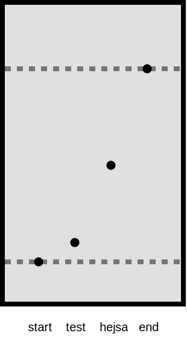

# quickChromagram

quickChromagram helps you make diagrams visualizing chromatography results quick, easy and consistent. 

We want to make it easy and effective to create illustrations for articles and teaching.

## How to get started?

1. Download the program
2. Open the `index.html` file in your browser

## Made in Denmark

Benjamin Bræstrup Sayoc ([benj5378](https://github.com/benj5378)), from the University of Copenhagen.

## Example

(render issues, plz open svg by itself in a new tab)

